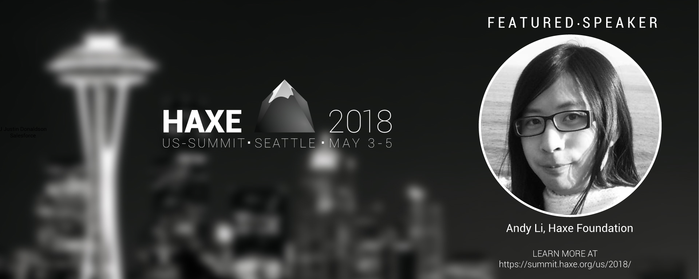

# Haxe Summit US 2018 Introductory Haxe Workshop

Workshop info: [Introductory Haxe Workshop](https://summit.haxe.org/us/2018/#talk-haxe-workshop)

This is an [agar.io](https://agar.io/) clone to demonstrate the capability of Haxe in building cross platform games,
where codes are shared among multiple game platforms (web, mac, windows, android & ios),
as well as between game client and game server for multiplayer games.

Demo: https://andyli.github.io/HaxeSummitUS2018Workshop/ (single player mode)

## Preparation

Participants should have programming experience with at least one programming language. Proficiency with JavaScript, Java, or C# is ideal, but experience with other languages such as C/C++, Python, or Ruby is also sufficient. Participants should have some familiarity using the command line. Participants should bring their own laptop computer, with either Windows, Mac, or Linux installed.

Please follow the instruction listed below before the workshop, such that you can progress smoothly.

### Install Haxe

Get Haxe from https://haxe.org/download/. We recommend 3.4.7, but 4.0.0-preview.3 is also fine.

### Install Node.js

Get Node.js from https://nodejs.org/. We recommend the LTS version, but the latest release is also fine.

### Install Git

Get [Git](https://git-scm.com/) and make it available in the command line. i.e. `git --version` should print something like `git version 2.7.4`.

### Install Visual Studio Code

Although in theory you can use any [IDE or text editor](https://haxe.org/documentation/introduction/editors-and-ides.html), we recommend using [Visual Studio Code](https://code.visualstudio.com/) with the [Haxe Extension Pack](https://marketplace.visualstudio.com/items?itemName=vshaxe.haxe-extension-pack), which offers the best Haxe support at the moment.

## Notes (&#9888; WORK-IN-PROGRESS)

We will introduce Haxe and go through creating a simple multi-player game during the workshop together. The instruction will be given during the workshop. Below are some notes for future reference.

The workshop is divided into 5 sections:

 1. [Getting started](section1.md)
    * what is Haxe
    * showcases
    * download and install
 2. [Haxe programming basics](section2.md)
    * VSCode project setup
    * basic building blocks
 3. [Game building with Heaps](section3.md)
    * using Haxe libraries and frameworks
    * game architecture
 4. [Using NodeJS](section4.md)
    * using native libraries (writing externs)
    * NodeJS basics (CLI, NPM)
 5. [Multiplayer](section5.md)
    * server-client communication

### quick links

 * Haxe Manual: https://haxe.org/manual/introduction.html
 * Haxe API docs: https://devdocs.io/ (or http://api.haxe.org/)
 * Try Haxe: https://try.haxe.org/
 * Heaps: https://heapsio.github.io/heaps.io/ (the WIP new website)
 * `haxe-ws` library: https://lib.haxe.org/p/haxe-ws
 * `ws` npm package: https://www.npmjs.com/package/ws#usage-examples

### Shared Code

The `World` class contains the core game logic.
When the game is set to single-player mode, the `World` is run in the client.
In other words, the same piece of Haxe code for the `World` class is compiled into different platforms
(web, mac, windows, android & ios).
When the game is in multi-player mode, the `World` is run on the server. Again, the same piece of 
Haxe code for the `World` class is compiled into the server language (nodejs for our choice here).

The `Command` and `Message` enums represents the protocol between the client and server in multiplayer
mode. The same piece of code is used in both client and server.

## Feedback / Questions

Feel free to [open issues](https://github.com/andyli/HaxeSummitUS2018Workshop/issues) or contact us directly.

## License

  
   
  To the extent possible under law,
  
    Andy Li
  has waived all copyright and related or neighboring rights to
  Haxe Summit US 2018 Introductory Haxe Workshop.
This work is published from:

  Hong Kong.

